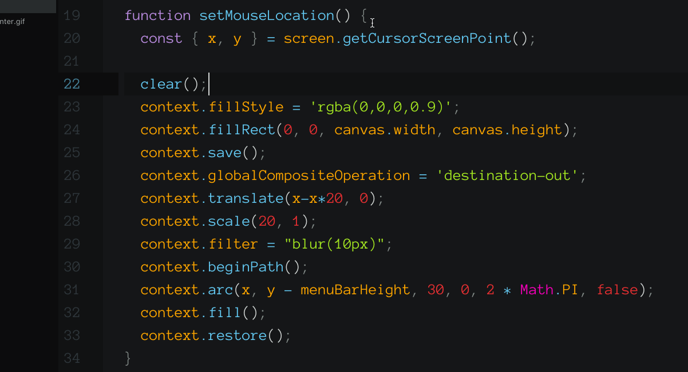

# Desktop Presenter

A simple desktop app to highlight and track the location of the mouse for presentations

Use keyboard short-cut: CMD+CTRL+H to active/deactivate the highlight.

## TODO:
* [ ] System tray icon to hide/show overlay and adjust size/color
